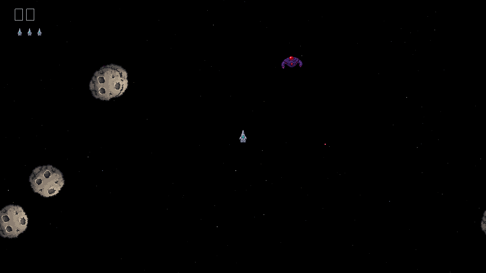

# ROCK BLASTER

A small, readable vector arcade shooter in the spirit of the 1970s/80s vector games: steer a ship
through drifting rocks, shoot them into smaller pieces and dodge flying saucers. Built with the
[Emerald](https://github.com/Ridejock/Emerald) C++20 engine (SDL3 + SDL GPU). The repository and
the CMake targets are still called `Asteroids` (the code's working name); the game itself is
published under its own title, set in one place (see [The game's name](#the-games-name)). It is an
original work: its code, look and sounds are made from scratch, and it uses no assets of any
other game.

It comes in two versions that play exactly the same (same rules, sounds, controls and code, apart
from drawing):

- **Vector** (target `Asteroids`, `RockBlaster.exe`): everything on screen (ship, rocks, bullets,
  explosions, the logo, even the score digits and letters) is drawn with lines by Emerald's
  `Renderer2D`; there are no textures or font files. **This is the released game.**
- **Pixel** (target `AsteroidsPixel`, `RockBlasterPixel.exe`): sprites from `assets/pixel/` (one
  texture atlas) over a twinkling starfield, with small pixel bullets and sparks. The text keeps
  the vector font. Not part of the release.

## The game's name

The game is called "ROCK BLASTER". The title exists in exactly one place, the CMake cache variable
**`GAME_TITLE`** at the top of `CMakeLists.txt`:

```sh
cmake --preset release -DGAME_TITLE="NEW NAME"   # or change the default in CMakeLists.txt
```

It feeds the window title, the title screen logo, the `.exe` names (`GAME_FILE_NAME`, derived as
PascalCase: "NEW NAME" → `NewName.exe`, `NewNamePixel.exe`; set it to override), the Windows
version resource (file description, product name), the per-user folder for settings and high
scores, the README in the package, and the zip's name. The code reads it from the generated
`GameInfo.h` (`src/Shared/GameInfo.h.in`). Upper case looks best in the vector font (A–Z, 0–9 and
a few symbols).




## Controls

| Action | Keyboard | Gamepad (Xbox / PlayStation / Switch Pro) |
|---|---|---|
| Rotate left / right | **A / D** or **← / →** | **left stick** (analog: tilt a little to turn slowly) or **d-pad ← / →** |
| Thrust | **W** or **↑** | **left stick up**, **right trigger** (RT / R2 / ZR) or **d-pad ↑** |
| Fire (at most 4 shots on screen) | **Space** | **South** (A / Cross / B) or **right shoulder** (RB / R1 / R) |
| Hyperspace: jump to a random spot (1 s cooldown) | **Shift** | **North** (Y / Triangle / X) |
| Start a game (title screen), new game after *Game Over* | **Enter** or **Space** | **Start** (Menu / Options / +) or **South** |
| Pause menu / title menu | **Esc** or **P** | **Start** (Menu / Options / +) |
| Fullscreen on / off | **F11** or **Alt+Enter** | – |
| Initials: change letter (A–Z, space) | **W / S** or **↑ / ↓** (hold to repeat) | **d-pad ↑ / ↓** or **left stick up / down** |
| Initials: next letter / done | **Enter** or **Space** | **South** (A / Cross / B) |
| Initials: previous letter | **Backspace** | **East** (B / Circle / A) |
| Mute / unmute sound | **M** | **Back** (View / Share / −) |
| Menus: choose / change / confirm / back | **↑ ↓** / **← →** / **Enter**, **Space** / **Esc**, **Backspace** | **d-pad** or **left stick** / **South** / **East** (B / Circle / A) |

Gamepad buttons are bound by position, so South is the bottom face button on every pad: A on Xbox,
Cross on PlayStation, B on a Switch Pro Controller (the game over screen shows the right name,
e.g. "PRESS OPTIONS / ENTER" or "CROSS / ENTER: NEXT"). Any connected pad works (USB or Bluetooth, plugged in at any time), and the pad
rumbles briefly when your ship is destroyed. Stick deadzone: 20% (radial).

The inputs are bound to named actions (`Rotate` axis, `Thrust`, `Fire`, `Hyperspace`, `Start`,
`Pause`, `Mute`, and for menus `MenuUp`, `MenuDown`, `MenuLeft`, `MenuRight`, `Confirm`, `Back`,
`MenuBack`) in `AsteroidsApp::BindControls` in `src/Shared/AsteroidsApp.cpp` (both versions); change a binding there, or at runtime with
`GetInput().RebindAction(...)`.

## Title screen, pause and options

The game opens on the **title screen**: the name in large glowing vector letters over slowly
drifting rocks, cycling every 7 s between the start prompt, the high score table (skipped while it
is empty) and the controls. Start / Enter begins a game; Esc (or the pad's Start) opens a small
menu (Start game, Options, Quit game). 20 s after a game over the game returns to the title by
itself.

During a game, **Esc / P / pad Start pauses** with a menu: *Resume*, *Options*, *Quit to title*,
*Quit game*. The game also pauses by itself when its window loses focus (Alt+Tab).

**Options:** master volume and effects volume (0–100 in steps of 10), fullscreen (borderless, on
the current display), vsync, screen shake (a short jolt on explosions), and the controls
reference. Every change applies at once and is saved to `settings.txt` in the per-user folder
(see [High scores](#high-scores) for where that is), one `key = value` per line:

```
master_volume = 80
sfx_volume = 100
fullscreen = off
vsync = on
screen_shake = on
```

Unknown keys and bad values are ignored, so a hand-edited file cannot break the game. (Runs with
`--frames` never write it and always start windowed.)

## Sound

Every sound is generated when the game starts (Emerald's `Synth`, see `src/Shared/Sounds.cpp`); there are
no audio files.

| Sound | When | How it is made |
|---|---|---|
| Fire | each shot | square wave sweeping 1400 → 350 Hz, fast decay |
| Thrust | while the engine fires | dark lowpassed noise, seamless 1 s loop; fades in (40 ms) and out (120 ms), stops on death and game over |
| Explosions | rock destroyed | noise bursts falling in pitch; large rocks lower and longer (1 s), small ones brighter and shorter (0.45 s) |
| Ship explosion | ship destroyed | long noise crash plus a falling sine rumble (1.6 s) |
| Extra life | every 10,000 points | four quick 1.5 kHz beeps |
| Hyperspace | jump | noise whoosh rising in pitch |
| Saucer siren | while a saucer is on screen | looping square-wave warble (vibrato): large saucer 330 Hz wobbling 4×/s, small saucer 760 Hz wobbling 8×/s; fades in, and out (150 ms) when the saucer is destroyed, flies off or the game ends |
| Saucer shot | each saucer shot | thin pulse wave sweeping 1000 → 280 Hz |
| Heartbeat | during a wave | two alternating low thumps; 1 beat per second at the start of a wave, speeding up to 4 per second as the rocks are destroyed; restarts with each wave, silent between waves and on the game over screen |

Sounds are panned by where they happen on screen. **M** (or the pad's Back button) mutes; the
options menu sets the master and effects volume; the debug-full build's ImGui panel has master and ambience volume sliders, a mute checkbox and the list
of loaded overrides.

### Your own sounds (optional, local builds only)

Any sound can be replaced by a file of your own, without changing code, and the repository never
contains such files. **They are never part of the release package** (nothing from `assets/` is
installed or zipped), so the published game only ever has its generated sounds. Put `<name>.mp3` or `<name>.wav` into `assets/sounds/` in the source tree (the
build copies that folder next to the executable) or directly into `build/<preset>/bin/assets/sounds/`:

`fire`, `thrust`, `bang_large`, `bang_medium`, `bang_small`, `ship_explode`, `extra_life`, `beat1`,
`beat2`, `hyperspace`, `saucer_large`, `saucer_small` (both looped while the saucer is on screen),
`saucer_fire`, plus two extras with no generated version:

- `music` loops on the title and game over screens only (fades in over 1.5 s, out when a new game starts).
- `ambience` loops quietly (25%, adjustable in the debug panel) under the gameplay and the
  heartbeat; it fades in when a game starts and out on game over.

Missing files keep the generated sound, and the log lists what was loaded (`Sound overrides from
...: fire, ambience`). Each file is scaled to the peak level of the sound it replaces (music and
ambience to 0.8), so full-scale clips do not drown out the rest. A `thrust` file is looped, so it
(and the saucer sirens) should loop seamlessly. `assets/sounds/*` is in `.gitignore` except its `README.md`, which lists the
names too. The game logic only
reports sound events (`Game::GetSounds`); `AsteroidsApp::PlayGameSounds` in `src/Shared/AsteroidsApp.cpp` plays
them. Both versions use the same sounds and overrides.

## Rules

- You have **3 ships**; an extra one every 10 000 points.
- Large rocks split into 2 medium ones, medium into 2 small, small ones vanish. Points: 20 / 50 / 100.
- Now and then a **flying saucer** enters from the left or right edge, flies across (changing
  between straight and diagonal now and then, wrapping top ↔ bottom) and leaves at the far edge. The first
  one comes after 10–16 s, and they come a second sooner each wave (down to 5–11 s).
  - **Large saucer**, 200 points: slow, shoots in random directions.
  - **Small saucer**, 1000 points: faster, and aims at you, roughly at first (±20°) and almost
    perfectly (±2°) from 40 000 points. It is rare at the start (10%), more likely as your score
    grows, and from 40 000 points every saucer is a small one.
  - Saucer shots destroy your ship and rocks (no points for those rocks). Saucers crash into rocks
    too. Shooting or ramming a saucer scores its points (ramming costs a ship).
- After a crash the ship respawns in the center after 2 s and blinks for 3 s, during which it cannot
  be destroyed.
- Clear the field to start the next wave, which has one more large rock (up to 11).
- Everything wraps around the screen edges.

## High scores

The **top 10** are kept, arcade style, with 3-letter initials. If your score makes the table,
the game asks for your initials when it ends: change the blinking letter with up/down (A–Z, then
space), confirm it with Enter / Space / South, and go back a letter with Backspace / East. After the
third letter the table is shown with your entry blinking, then the start prompt. The best score is
shown small at the top of the screen while you play.

The table is saved as a plain text file in your per-user folder (`Paths::GetPrefPath("Ridejock",
GAME_FILE_NAME)` from Emerald, via SDL), next to `settings.txt` and the `logs/` folder. Each
version keeps its own table: `highscores.txt` for the vector version, `highscores_pixel.txt` for
the pixel one. With the default name the folder is:

| OS | Folder |
|---|---|
| Windows | `%APPDATA%\Ridejock\RockBlaster\` (e.g. `C:\Users\you\AppData\Roaming\...`) |
| Linux | `~/.local/share/Ridejock/RockBlaster/` |
| macOS | `~/Library/Application Support/Ridejock/RockBlaster/` |

(Older builds used `Ridejock/Asteroids/` or, before the final name, `Ridejock/RockDrift/`; move
`highscores.txt` and `settings.txt` over to keep them.)

The log shows the exact path at startup (`High scores file: ...`). Each line is initials, a space,
and the score, e.g. `ABC 12340` (initials are always 3 characters and may contain spaces). A missing
file means an empty table; unreadable lines are skipped; the file is rewritten (via a temporary
file) whenever an entry is added. Delete it to reset the table.

## Building

Requirements: CMake 3.24+, Ninja, Git and a C++20 compiler (MSVC 2022, GCC 11+, Clang 14+). The engine
and all its dependencies (SDL3, spdlog, stb, and the SDL_shadercross shader compiler) are fetched and
built automatically.

> **First build takes a while** (≈10–20 minutes): Emerald builds SDL_shadercross, including
> Microsoft's DirectXShaderCompiler, from source into `build/_shadercross`. It is shared by all presets
> and only built once. See [Engine development](#engine-development) to reuse an existing Emerald
> checkout's build instead.

### Windows – VS Code (CMake Tools) + MSVC

1. Install **Visual Studio 2022** (or the *Build Tools*) with the *Desktop development with C++*
   workload (includes MSVC, CMake and Ninja), Git, and VS Code with the **C/C++** and **CMake Tools**
   extensions.
2. Open the `Asteroids` folder in VS Code. CMake Tools reads `CMakePresets.json` (same presets as
   Emerald's, so it works exactly like building the engine); pick the configure preset **Debug** (or
   Release / Debug (ImGui debug overlay)) in the status bar.
3. **Build** (F7), then **Run/Debug** the `Asteroids` or `AsteroidsPixel` target (pick it as the
   launch target in the status bar; Shift+F5 / Ctrl+F5). The executables are
   `build\<preset>\bin\RockBlaster.exe` and `RockBlasterPixel.exe`, sharing the compiled shaders in
   `build\<preset>\bin\shaders\` and the copied `assets\`.

From a *Developer PowerShell / x64 Native Tools prompt for VS 2022* instead:

```powershell
cmake --preset debug
cmake --build --preset debug
.\build\debug\bin\RockBlaster.exe
.\build\debug\bin\RockBlasterPixel.exe
```

### Linux / macOS

```sh
cmake --preset debug
cmake --build --preset debug
./build/debug/bin/RockBlaster
./build/debug/bin/RockBlasterPixel
```

(On Linux, SDL3 needs the usual X11/Wayland development packages; see Emerald's README.)

Tests (`ASTEROIDS_BUILD_TESTS`, on by default): `SoundOverrides` (the override loader),
`GameLogic` (high score table: insert, sort, top 10, parse/serialize; saucer aiming) and
`MenusAndSettings` (settings.txt parsing/writing, menu navigation, title screen pages):

```sh
ctest --test-dir build/debug --output-on-failure
```

### Presets

| Preset | Description |
|---|---|
| `debug` | Debug build |
| `release` | Optimized build; on Windows a GUI program (no console window) with the C++ runtime linked in (`/MT`): this is what gets packaged |
| `debug-full` | Debug build with Emerald's Dear ImGui overlay (`EMERALD_USE_IMGUI=ON`): FPS, wave, score, line/sprite/draw call counts |

### Command line

Both executables take the same options:

```sh
RockBlaster --frames 600                        # quit after 600 frames
RockBlaster --frames 600 --screenshot shot.png  # save the last frame as a PNG
RockBlaster --seed 42                           # repeatable asteroid layout
RockBlaster --screen options                    # start on: title, scores, controls (title pages),
                                              #   play, pause, options, or logo (store cover)
RockBlaster --saucer small                      # testing: a game with a saucer (large|small)
RockBlaster --game-over 12345                   # testing: end at once with this score
```

The debug-full build's ImGui panel also has *Large saucer*, *Small saucer* and *Game over* buttons.

The log is written to `logs/RockBlaster.log` (`logs/RockBlasterPixel.log` for the pixel version) in
the per-user folder (see [High scores](#high-scores)), so it works from a read-only install too. If the pixel version cannot find its sprites (`assets/pixel/` next to the
executable) it logs an error and draws the objects' outlines instead.

## Release (itch.io)

The release is a zip of the vector version for 64-bit Windows:

```powershell
cmake --preset release
cmake --build --preset release
cmake --build --preset release --target package
# -> build\release\RockBlaster-1.0.0-windows-x64.zip
```

It contains `RockBlaster.exe` (icon and version info embedded; static C++ runtime and SDL3, so it
runs on a clean Windows 10/11 PC), the compiled `shaders\` folder, `README.txt` (controls, rules,
credits, generated from `packaging/README.txt.in`), `LICENSE.txt` and `THIRD_PARTY_LICENSES.txt`
(the licenses of Emerald, SDL3 with HIDAPI, spdlog + {fmt}, stb, nlohmann/json and dr_mp3, taken
from the fetched sources at configure time). Nothing from `assets/` is packaged. The rules are in
`cmake/Packaging.cmake`; `cmake --install build/release --component Game --prefix <dir>` gives
the same files unzipped. The version is `project(... VERSION ...)` in `CMakeLists.txt`.

**GitHub Actions** (`.github/workflows/release.yml`) builds this on `windows-latest` for every
push to `main` and uploads the zip as a workflow artifact. Pushing a tag `v1.0.0` (etc.) also
attaches it to a GitHub release:

```sh
git tag v1.0.0 && git push origin v1.0.0
```

**Uploading to itch.io** with [butler](https://itch.io/docs/butler/) (after creating the game page
on itch.io; `butler login` once):

```sh
butler push RockBlaster-1.0.0-windows-x64.zip <itch-user>/<game-page>:windows --userversion 1.0.0
```

The icon (`assets/icon/icon.ico` + `icon.png`) is drawn by code (`src/Shared/Icon.cpp`, the ship
outline with a glow); after changing it, regenerate the committed files with
`cmake --build --preset release --target UpdateIcon`. The window icon is made at startup from the
same code.

## Engine development

Emerald is pulled in with `FetchContent`, pinned to a commit in `CMakeLists.txt` (`GIT_TAG`). To
develop the engine and the game side by side, point the build at a local Emerald checkout:

```powershell
cmake --preset debug -DASTEROIDS_EMERALD_SOURCE_DIR=C:/dev/Emerald
```

Engine changes are then picked up by the next game build, and the checkout's `build/_shadercross`
is reused (no second shader-compiler build). This is shorthand for CMake's own
`-DFETCHCONTENT_SOURCE_DIR_EMERALD=...`. In VS Code you can put it in a `CMakeUserPresets.json`
(git-ignored), e.g.

```json
{
  "version": 6,
  "configurePresets": [
    {
      "name": "debug-local",
      "inherits": "debug",
      "cacheVariables": { "ASTEROIDS_EMERALD_SOURCE_DIR": "C:/dev/Emerald" }
    }
  ]
}
```

When the engine change is pushed, update `GIT_TAG` to the new commit hash. (To go back to the pinned
commit, clear the variable: `-DASTEROIDS_EMERALD_SOURCE_DIR=`.)

## Code tour

The code is one library with everything both versions share, plus one small executable per look:

```
src/Shared/   AsteroidsShared (static library): the game, its rules, sounds, controls, high scores,
              settings, the application loop, HUD, title screen and menus
src/Vector/   Asteroids: draws the world with lines
src/Pixel/    AsteroidsPixel: draws the world with sprites
assets/pixel/ the pixel sprites (atlas.png + atlas.json, and the single images for editing)
assets/icon/  the generated icon (icon.ico for the .exe, icon.png)
packaging/    README.txt template for the zip, Windows version resource (Game.rc.in)
cmake/        Packaging.cmake: what goes into the release zip
tools/IconGen writes assets/icon/ (the UpdateIcon target)
```

| File | What it does |
|---|---|
| `src/Shared/AsteroidsApp.h/.cpp` | The shared `Emerald::Application`: command line options, binds the controls as input actions, reads them in `OnFixedUpdate` (120 Hz), fits the playfield into the window in `OnRender2D` and calls the version's `DrawWorld` + `DrawHud`; plays the game's sound events and the thrust and saucer loops; loads and saves the high scores |
| `src/Vector/Main.cpp` | `VectorAsteroids`: `DrawWorld` with outlines (rocks, ship + flame, saucer, bullets, debris), `highscores.txt` |
| `src/Pixel/Main.cpp` | `PixelAsteroids`: loads the atlas in `OnLoadAssets`; `DrawWorld` with sprites scaled to the collision radii (see `Look::` constants), a procedural starfield, pixel bullets and sparks; ship sprites as life icons; `highscores_pixel.txt` |
| `src/Shared/Screens.h/.cpp` | The title screen: glowing logo, page cycling, the controls table |
| `src/Shared/Menu.h/.cpp` | A vertical vector-font menu (selection, wrap-around, values on the right) used by the title, pause and options menus |
| `src/Shared/Settings.h/.cpp` | The options and `settings.txt` |
| `src/Shared/Icon.h/.cpp` | Draws the ship icon into an image (window icon, `.ico`) |
| `src/Shared/GameInfo.h.in` | Title, file name, version: filled in by CMake from `GAME_TITLE` and the project version |
| `src/Shared/Game.h/.cpp` | Game state and rules: waves, bullets, saucers, collisions, lives, score, explosions, HUD, initials entry and the high score screen, sound events and the heartbeat timing. Exposes read-only state (`GetShip`, `GetAsteroids`, `GetParticles`, ...) for the renderers |
| `src/Shared/Saucer.h/.cpp` | The flying saucer: sizes, speeds, points, outline, and the aiming math |
| `src/Shared/HighScores.h/.cpp` | The top-10 table: ordering, the text file format, loading and saving |
| `src/Shared/Sounds.h/.cpp` | All sound effects, generated at startup with Emerald's `Synth`; optional file overrides (`LoadOverrides`) |
| `src/Shared/Ship.h/.cpp` | Ship movement (rotation, thrust with inertia and drag) and its outline + flame |
| `src/Shared/Asteroid.h/.cpp` | Random jagged rocks, sizes, splitting, points |
| `src/Shared/Bullet.h` | Bullet data and limits |
| `src/Shared/VectorFont.h/.cpp` | A line-segment font (A–Z, 0–9, space and `- + = _ . , : ! ? / < > ' ( )`) on a 4 × 6 grid |
| `src/Shared/Playfield.h` | The fixed 1280 × 720 logical playfield: wrap-around, wrapped distances, drawing objects on both sides of an edge |
| `src/Shared/Random.h` | Tiny `std::mt19937` helper |
| `tests/SoundOverrideTests.cpp` | ctest for the override loader, with generated WAV files |
| `tests/GameLogicTests.cpp` | ctest for the high score table and the saucer's aim |
| `tests/MenuSettingsTests.cpp` | ctest for settings.txt, menu navigation and the title screen pages |

The game logic (`Game`) never touches the window or GPU: it gets a `GameInput` per fixed step, and
the executables draw its state into a `Renderer2D` that `AsteroidsApp` has already set up with the
right projection. The playfield is always 1280 × 720 logical pixels, scaled uniformly to the window
with black bars (and clipped) when the aspect ratio differs, so resizing the window never changes the
gameplay. Collisions use the same radii in both versions; the pixel version only scales its sprites
to match them, and picks between the two looks of each rock size by its spin direction, so it uses
no extra random numbers (the same `--seed` gives the same rocks in both).

### The pixel sprites

`assets/pixel/` holds the sprites (generated for this project, AI-assisted): `ship` (38 × 80,
pointing up, with the engine flames in its bottom rows, which are cropped off while not
thrusting), `enemy` (the saucer, 80 × 46) and two looks for each rock size
(`asteroid_large_1/2`, `asteroid_medium_1/2`, `asteroid_small_1/2`). The game loads only
`atlas.png` + `atlas.json` (name → x, y, w, h); see `assets/pixel/README.md`. The build copies the
whole `assets/` folder next to the executables.

## License

[MIT](LICENSE) © 2026 Ervin Ashley
