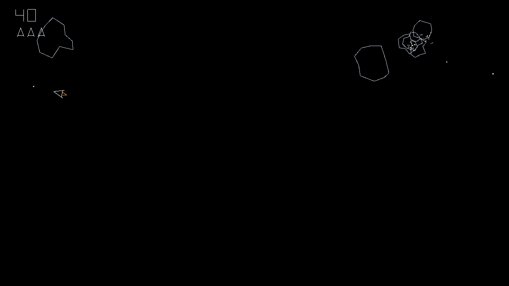

# Asteroids

A small, readable remake of the classic vector arcade game **Asteroids**, built with the
[Emerald](https://github.com/Ridejock/Emerald) C++20 engine (SDL3 + SDL GPU). Everything on screen —
ship, rocks, bullets, explosions, even the score digits and letters — is drawn with 1 px lines by
Emerald's `Renderer2D`; there are no textures or font files.



## Controls

| Action | Keyboard | Gamepad (Xbox / PlayStation / Switch Pro) |
|---|---|---|
| Rotate left / right | **A / D** or **← / →** | **left stick** (analog: tilt a little to turn slowly) or **d-pad ← / →** |
| Thrust | **W** or **↑** | **left stick up**, **right trigger** (RT / R2 / ZR) or **d-pad ↑** |
| Fire (at most 4 shots on screen) | **Space** | **South** (A / Cross / B) or **right shoulder** (RB / R1 / R) |
| Hyperspace: jump to a random spot (1 s cooldown) | **Shift** | **North** (Y / Triangle / X) |
| Restart after *Game Over* | **Enter** | **Start** (Menu / Options / +) or **South** |
| Initials: change letter (A–Z, space) | **W / S** or **↑ / ↓** (hold to repeat) | **d-pad ↑ / ↓** or **left stick up / down** |
| Initials: next letter / done | **Enter** or **Space** | **South** (A / Cross / B) |
| Initials: previous letter | **Backspace** | **East** (B / Circle / A) |
| Mute / unmute sound | **M** | **Back** (View / Share / −) |
| Quit | **Esc** | – |

Gamepad buttons are bound by position, so South is the bottom face button on every pad: A on Xbox,
Cross on PlayStation, B on a Switch Pro Controller (the game over screen shows the right name,
e.g. "PRESS OPTIONS / ENTER" or "CROSS / ENTER: NEXT"). Any connected pad works (USB or Bluetooth, plugged in at any time), and the pad
rumbles briefly when your ship is destroyed. Stick deadzone: 20% (radial).

The inputs are bound to named actions (`Rotate` axis, `Thrust`, `Fire`, `Hyperspace`, `Start`,
`Mute`, `Quit`, and for menus `MenuUp`, `MenuDown`, `Confirm`, `Back`) in `AsteroidsApp::OnStart` in `src/Main.cpp`; change a binding there, or at runtime with
`GetInput().RebindAction(...)`.

## Sound

Every sound is generated when the game starts (Emerald's `Synth`, see `src/Sounds.cpp`); there are
no audio files.

| Sound | When | How it is made |
|---|---|---|
| Fire | each shot | square wave sweeping 1400 → 350 Hz, fast decay |
| Thrust | while the engine fires | dark lowpassed noise, seamless 1 s loop; fades in (40 ms) and out (120 ms), stops on death and game over |
| Explosions | rock destroyed | noise bursts falling in pitch; large rocks lower and longer (1 s), small ones brighter and shorter (0.45 s) |
| Ship explosion | ship destroyed | long noise crash plus a falling sine rumble (1.6 s) |
| Extra life | every 10,000 points | four quick 1.5 kHz beeps |
| Hyperspace | jump | noise whoosh rising in pitch |
| Saucer siren | while a saucer is on screen | looping square-wave warble (vibrato): large saucer 330 Hz wobbling 4×/s, small saucer 760 Hz wobbling 8×/s; fades in, and out (150 ms) when the saucer is destroyed, flies off or the game ends |
| Saucer shot | each saucer shot | thin pulse wave sweeping 1000 → 280 Hz |
| Heartbeat | during a wave | the classic two alternating low thumps; 1 beat per second at the start of a wave, speeding up to 4 per second as the rocks are destroyed; restarts with each wave, silent between waves and on the game over screen |

Sounds are panned by where they happen on screen. **M** (or the pad's Back button) mutes; the
debug-full build's ImGui panel has master and ambience volume sliders, a mute checkbox and the list
of loaded overrides.

### Your own sounds (optional)

Any sound can be replaced by a file of your own, without changing code, and the repository never
contains such files. Put `<name>.mp3` or `<name>.wav` into `assets/sounds/` in the source tree (the
build copies that folder next to the executable) or directly into `build/<preset>/bin/assets/sounds/`:

`fire`, `thrust`, `bang_large`, `bang_medium`, `bang_small`, `ship_explode`, `extra_life`, `beat1`,
`beat2`, `hyperspace`, `saucer_large`, `saucer_small` (both looped while the saucer is on screen),
`saucer_fire`, plus two extras with no generated version:

- `music` loops on the game over screen only (fades in over 1.5 s, out when a new game starts).
- `ambience` loops quietly (25%, adjustable in the debug panel) under the gameplay and the
  heartbeat; it fades in when a game starts and out on game over.

Missing files keep the generated sound, and the log lists what was loaded (`Sound overrides from
...: fire, ambience`). Each file is scaled to the peak level of the sound it replaces (music and
ambience to 0.8), so full-scale clips do not drown out the rest. A `thrust` file is looped, so it
(and the saucer sirens) should loop seamlessly. `assets/sounds/*` is in `.gitignore` except its `README.md`, which lists the
names too. The game logic only
reports sound events (`Game::GetSounds`); `AsteroidsApp::PlayGameSounds` in `src/Main.cpp` plays
them.

## Rules

- You have **3 ships**; an extra one every 10 000 points.
- Large rocks split into 2 medium ones, medium into 2 small, small ones vanish. Points: 20 / 50 / 100.
- Now and then a **flying saucer** enters from the left or right edge, flies across (changing
  between straight and diagonal now and then, wrapping top ↔ bottom) and leaves at the far edge. The first
  one comes after 10–16 s, and they come a second sooner each wave (down to 5–11 s).
  - **Large saucer**, 200 points: slow, shoots in random directions.
  - **Small saucer**, 1000 points: faster, and aims at you, roughly at first (±20°) and almost
    perfectly (±2°) from 40 000 points. It is rare at the start (10%), more likely as your score
    grows, and from 40 000 points every saucer is a small one.
  - Saucer shots destroy your ship and rocks (no points for those rocks). Saucers crash into rocks
    too. Shooting or ramming a saucer scores its points (ramming costs a ship).
- After a crash the ship respawns in the center after 2 s and blinks for 3 s, during which it cannot
  be destroyed.
- Clear the field to start the next wave, which has one more large rock (up to 11).
- Everything wraps around the screen edges.

## High scores

The **top 10** are kept, arcade style, with 3-letter initials. If your score makes the table,
the game asks for your initials when it ends: change the blinking letter with up/down (A–Z, then
space), confirm it with Enter / Space / South, and go back a letter with Backspace / East. After the
third letter the table is shown with your entry blinking, then the start prompt. The best score is
shown small at the top of the screen while you play.

The table is saved as a plain text file in your per-user folder (`Paths::GetPrefPath("Ridejock",
"Asteroids")` from Emerald, via SDL):

| OS | File |
|---|---|
| Windows | `%APPDATA%\Ridejock\Asteroids\highscores.txt` (e.g. `C:\Users\you\AppData\Roaming\...`) |
| Linux | `~/.local/share/Ridejock/Asteroids/highscores.txt` |
| macOS | `~/Library/Application Support/Ridejock/Asteroids/highscores.txt` |

The log shows the exact path at startup (`High scores file: ...`). Each line is initials, a space,
and the score, e.g. `ABC 12340` (initials are always 3 characters and may contain spaces). A missing
file means an empty table; unreadable lines are skipped; the file is rewritten (via a temporary
file) whenever an entry is added. Delete it to reset the table.

## Building

Requirements: CMake 3.24+, Ninja, Git and a C++20 compiler (MSVC 2022, GCC 11+, Clang 14+). The engine
and all its dependencies (SDL3, spdlog, stb, and the SDL_shadercross shader compiler) are fetched and
built automatically.

> **First build takes a while** (≈10–20 minutes): Emerald builds SDL_shadercross, including
> Microsoft's DirectXShaderCompiler, from source into `build/_shadercross`. It is shared by all presets
> and only built once. See [Engine development](#engine-development) to reuse an existing Emerald
> checkout's build instead.

### Windows – VS Code (CMake Tools) + MSVC

1. Install **Visual Studio 2022** (or the *Build Tools*) with the *Desktop development with C++*
   workload (includes MSVC, CMake and Ninja), Git, and VS Code with the **C/C++** and **CMake Tools**
   extensions.
2. Open the `Asteroids` folder in VS Code. CMake Tools reads `CMakePresets.json` (same presets as
   Emerald's, so it works exactly like building the engine); pick the configure preset **Debug** (or
   Release / Debug (ImGui debug overlay)) in the status bar.
3. **Build** (F7), then **Run/Debug** the `Asteroids` target (Shift+F5 / Ctrl+F5).
   The executable is `build\<preset>\bin\Asteroids.exe`, with its compiled shaders in
   `build\<preset>\bin\shaders\`.

From a *Developer PowerShell / x64 Native Tools prompt for VS 2022* instead:

```powershell
cmake --preset debug
cmake --build --preset debug
.\build\debug\bin\Asteroids.exe
```

### Linux / macOS

```sh
cmake --preset debug
cmake --build --preset debug
./build/debug/bin/Asteroids
```

(On Linux, SDL3 needs the usual X11/Wayland development packages; see Emerald's README.)

Tests (`ASTEROIDS_BUILD_TESTS`, on by default): `SoundOverrides` (the override loader) and
`GameLogic` (high score table: insert, sort, top 10, parse/serialize; saucer aiming):

```sh
ctest --test-dir build/debug --output-on-failure
```

### Presets

| Preset | Description |
|---|---|
| `debug` | Debug build |
| `release` | Optimized build |
| `debug-full` | Debug build with Emerald's Dear ImGui overlay (`EMERALD_USE_IMGUI=ON`): FPS, wave, score, line count |

### Command line

```sh
Asteroids --frames 600                        # quit after 600 frames
Asteroids --frames 600 --screenshot shot.png  # save the last frame as a PNG
Asteroids --seed 42                           # repeatable asteroid layout
Asteroids --saucer small                      # testing: a saucer (large|small) right away
Asteroids --game-over 12345                   # testing: end at once with this score
```

The debug-full build's ImGui panel also has *Large saucer*, *Small saucer* and *Game over* buttons.

The log is written to `logs/Asteroids.log` next to the executable.

## Engine development

Emerald is pulled in with `FetchContent`, pinned to a commit in `CMakeLists.txt` (`GIT_TAG`). To
develop the engine and the game side by side, point the build at a local Emerald checkout:

```powershell
cmake --preset debug -DASTEROIDS_EMERALD_SOURCE_DIR=C:/dev/Emerald
```

Engine changes are then picked up by the next game build, and the checkout's `build/_shadercross`
is reused (no second shader-compiler build). This is shorthand for CMake's own
`-DFETCHCONTENT_SOURCE_DIR_EMERALD=...`. In VS Code you can put it in a `CMakeUserPresets.json`
(git-ignored), e.g.

```json
{
  "version": 6,
  "configurePresets": [
    {
      "name": "debug-local",
      "inherits": "debug",
      "cacheVariables": { "ASTEROIDS_EMERALD_SOURCE_DIR": "C:/dev/Emerald" }
    }
  ]
}
```

When the engine change is pushed, update `GIT_TAG` to the new commit hash. (To go back to the pinned
commit, clear the variable: `-DASTEROIDS_EMERALD_SOURCE_DIR=`.)

## Code tour

| File | What it does |
|---|---|
| `src/Main.cpp` | The `Emerald::Application`: binds the controls as input actions in `OnStart`, reads them in `OnFixedUpdate` (120 Hz), fits the playfield into the window and draws it in `OnRender2D`; plays the game's sound events and the thrust and saucer loops; loads and saves the high scores |
| `src/Game.h/.cpp` | Game state and rules: waves, bullets, saucers, collisions, lives, score, explosions, HUD, initials entry and the high score screen, sound events and the heartbeat timing |
| `src/Saucer.h/.cpp` | The flying saucer: sizes, speeds, points, outline, and the aiming math |
| `src/HighScores.h/.cpp` | The top-10 table: ordering, the text file format, loading and saving |
| `src/Sounds.h/.cpp` | All sound effects, generated at startup with Emerald's `Synth`; optional file overrides (`LoadOverrides`) |
| `tests/SoundOverrideTests.cpp` | ctest for the override loader, with generated WAV files |
| `tests/GameLogicTests.cpp` | ctest for the high score table and the saucer's aim |
| `src/Ship.h/.cpp` | Ship movement (rotation, thrust with inertia and drag) and its outline + flame |
| `src/Asteroid.h/.cpp` | Random jagged rocks, sizes, splitting, points |
| `src/Bullet.h` | Bullet data and limits |
| `src/VectorFont.h/.cpp` | A line-segment font (A–Z, 0–9, space and `- + = _ . , : ! ? / < > ' ( )`) on a 4 × 6 grid |
| `src/Playfield.h` | The fixed 1280 × 720 logical playfield: wrap-around, wrapped distances, drawing objects on both sides of an edge |
| `src/Random.h` | Tiny `std::mt19937` helper |

The game logic (`Game`) never touches the window or GPU: it gets a `GameInput` per fixed step and
draws into a `Renderer2D` that `Main.cpp` has already set up with the right projection. The playfield
is always 1280 × 720 logical pixels, scaled uniformly to the window with black bars (and clipped) when
the aspect ratio differs, so resizing the window never changes the gameplay.

## License

[MIT](LICENSE) © 2026 Ervin Ashley
